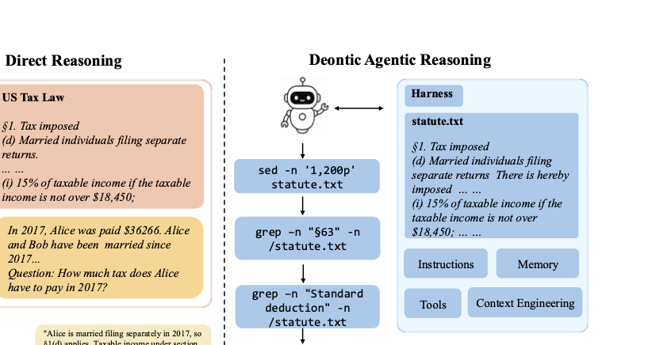

# Deontic Agentic Reasoning

<p align="center">
  
</p>

<p align="center">
  <em>In DAR (right), the statute is placed as a file in the harness, and the model examines it on the fly using general-purpose tools.</em>
</p>

> Built on top of [Harbor](https://github.com/harbor-framework/harbor) (Stanford / Terminal-Bench)
> and [meta-harness](https://github.com/stanford-iris-lab/meta-harness) (Stanford IRIS Lab).

This fork adapts Harbor and meta-harness to evaluate LLM agents on **deontic reasoning** tasks
— questions where the model must reason about obligations, permissions, and prohibitions under
a body of rules (statutes, regulations, terms of service). It packages four sub-domains as
Harbor tasks and provides ready-to-run scripts for several agent + model combinations.

## What's in the benchmark

Four sub-domains, ~173 tasks total per dataset variant:

| Sub-domain      | Tasks | Metric    | Source                        |
|-----------------|-------|-----------|-------------------------------|
| `sara-numeric`  | 35    | Accuracy  | US tax law numeric reasoning  |
| `sara-binary`   | 30    | Macro-F1  | US tax law binary judgments   |
| `airline`       | 80    | Accuracy  | Airline contract clauses      |
| `uscis-aao`     | 28    | Macro-F1  | USCIS administrative appeals  |

Three task framings live under `datasets/`:

- `deonticbench-direct` — agent writes a free-form answer to `/app/output/answer.txt`.
- `deonticbench-zeroshot` — agent writes a Prolog solution to `/app/solution.pl` (no examples).
- `deonticbench-fewshot` — same as zero-shot, but with examples mounted at `/app/examples.txt`.

There are also `deonticbench-cc-*` variants tailored to the `claude-code` agent.

## Setup

```bash
# 1. Clone (with the meta-harness submodule for Kira agents)
git clone --recurse-submodules <this-repo-url> harbor-deonticbench
cd harbor-deonticbench
# Or, if already cloned:
git submodule update --init --recursive

# 2. Install Harbor + dependencies (Python 3.12+, uv required)
uv sync --all-extras --dev

# 3. Export the API keys you plan to use
export OPENAI_API_KEY=...
export OPENROUTER_API_KEY=...
export ANTHROPIC_API_KEY=...
```

## Running experiments

All run scripts live in `deontic-scripts/`. They are organized by **agent family** (Non-Kira vs Kira)
and **model provider**. Each file is a self-contained reference — pick the command for your model
and dataset and paste it into your shell.

### Non-Kira agents (run from this repo root)

These use Harbor's built-in agents (`terminus-2`, `codex`, `claude-code`) directly. No `cd` needed.

| Script                                         | Agents                          | Notes                                   |
|------------------------------------------------|---------------------------------|-----------------------------------------|
| `deontic-scripts/gpt_run_commands.txt`         | terminus-2                      | OpenAI gpt-5.1 / gpt-5.2                |
| `deontic-scripts/openrouter_run_commands.txt`  | terminus-2, codex               | OpenRouter (qwen3-235b)                 |
| `deontic-scripts/qwen_run_commands.txt`        | terminus-2                      | Together AI hosted Qwen                 |
| `deontic-scripts/vllm_run_commands.txt`        | terminus-2, codex, claude-code  | Self-hosted vLLM via SSH tunnel         |

Example:

```bash
harbor run \
  --path datasets/deonticbench-direct \
  --agent terminus-2 \
  --model openai/gpt-5.2-2025-12-11 \
  --ae OPENAI_API_KEY=$OPENAI_API_KEY \
  --ak reasoning_effort=medium \
  --n-concurrent 2 \
  --jobs-dir jobs/deontic-direct
```

### Kira agents (run from inside meta-harness)

These use meta-harness reference agents (`baseline_kira`, `kira_compute_then_answer`,
`kira_deontic_grounded`) via Harbor's `--agent-import-path` flag. The import path is resolved
relative to the current working directory, so you must `cd` first:

```bash
cd meta-harness/reference_examples/terminal_bench_2
```

Then run from one of:

| Script                                              | Provider     |
|-----------------------------------------------------|--------------|
| `deontic-scripts/kira_gpt_run_commands.txt`         | OpenAI       |
| `deontic-scripts/kira_openrouter_run_commands.txt`  | OpenRouter   |

The scripts use `../../../datasets/...` for `--path` so they work for anyone who clones the repo
(no machine-specific paths). Example:

```bash
cd meta-harness/reference_examples/terminal_bench_2
uv run harbor run \
  --agent-import-path agents.baseline_kira:AgentHarness \
  --path ../../../datasets/deonticbench-direct \
  -m openai/gpt-5.2-2025-12-11 \
  --ae OPENAI_API_KEY=$OPENAI_API_KEY \
  --ak reasoning_effort=medium \
  --n-concurrent 2 \
  --jobs-dir jobs/deontic-direct
```

## Evaluating results

There are two evaluators, matching where the jobs land:

**Non-Kira runs** → `jobs/` at the repo root → use the evaluator at the repo root:

```bash
python evaluate_deonticbench.py jobs/deontic-direct
# Or score everything under jobs/
python evaluate_deonticbench.py
# Combine multiple jobs-dirs into one CSV
python evaluate_deonticbench.py jobs/deontic-direct jobs/deontic-zeroshot --output results.csv
# Strict scoring — count errored trials (timeouts, parse failures, missing stdout) as incorrect
python evaluate_deonticbench.py jobs/deontic-direct --errors-as-incorrect --output results-strict.csv
# Per-trial trace
python evaluate_deonticbench.py jobs/deontic-direct --verbose
```

**Kira runs** → `meta-harness/reference_examples/terminal_bench_2/jobs/` → use the evaluator
that ships with meta-harness (`evaluate_jobs.py` in that directory). It understands the deeper
job-directory layouts produced by Kira agents and reads the agent identity from each result's
`config.agent.import_path` (e.g. `agents.baseline_kira:AgentHarness` → `baseline_kira`):

```bash
cd meta-harness/reference_examples/terminal_bench_2

python evaluate_jobs.py jobs/deontic-direct
# Or score everything under jobs/
python evaluate_jobs.py
# Combine multiple jobs-dirs into one CSV
python evaluate_jobs.py jobs/deontic-direct jobs/deontic-direct-airline-only --output results-direct-kira.csv
# Per-trial trace
python evaluate_jobs.py jobs/deontic-direct --verbose
```

Both report the same metrics — Accuracy for `sara-numeric` / `airline`, Macro-F1 for `sara-binary`
/ `uscis-aao` — and both keep only the latest run when a model appears multiple times in the same
jobs-dir. CSVs include per-subdomain scores plus token / cost / error usage; `evaluate_jobs.py`
additionally writes an `overall_accuracy` column and splits `agent` / `model` into separate columns.

## Regenerating the datasets

The Harbor tasks under `datasets/` are produced from the upstream DeonticBench source by adapters
in `adapters/deonticbench_*`. See `deontic_adapters_scripts.txt` for the regeneration commands —
you'll need a local checkout of [DeonticBench](https://arxiv.org/abs/2604.04443) and to set
`DEONTICBENCH_ROOT` to its path.

## Repository layout

```
harbor-deonticbench/
├── datasets/                # Generated Harbor tasks (deonticbench-{direct,zeroshot,fewshot}*)
├── adapters/deonticbench_*  # Adapters that produce datasets/ from upstream DeonticBench
├── deontic-scripts/         # Run commands for each (agent, provider) combination
├── meta-harness/            # Submodule — Kira agents (Stanford IRIS Lab)
├── evaluate_deonticbench.py # Scoring script
├── src/harbor/              # Vendored Harbor source (unchanged from upstream)
└── jobs/                    # Default output dir for `harbor run` (gitignored)
```

## Credits

This project would not exist without:

- **Harbor** — the agent evaluation framework. https://github.com/harbor-framework/harbor
- **meta-harness** — the Kira agent baselines. https://github.com/stanford-iris-lab/meta-harness
- **DeonticBench** — the underlying benchmark. [arxiv.org/abs/2604.04443](https://arxiv.org/abs/2604.04443)

If you use this fork, please also cite the upstream projects.
